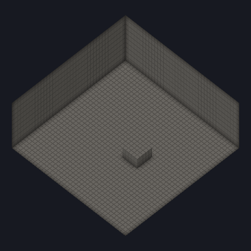
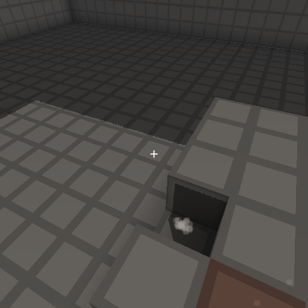
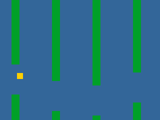

<picture>
  <source media="(prefers-color-scheme: dark)" srcset="assets/renew-banner-wide.svg">
  <source media="(prefers-color-scheme: light)" srcset="assets/renew-banner-wide-light.svg">
  
</picture>

 
 

### A game engine in Rust, built to be *operated*

 

Most engines are built around an editor, and everything else reaches the engine through whatever
that editor exposes. renew is built the other way around. Every capability is a library with a
command-line face and machine-readable output, so a developer at a terminal, a build script, a CI
job and an autonomous agent all drive it the same way. That is what *AI-first* means here.

The simulation underneath is bit-deterministic: same build, same seed, same inputs, same result,
byte for byte. CI checks that on five targets at once, desktop and mobile, and a digest that
differs anywhere fails the build.

<table>
<tr>
<td width="33%"></td>
<td width="33%"></td>
<td width="33%"></td>
</tr>
</table>

Left and centre: <code>cube</code>. Right: <code>glide</code>. Two of the six samples that ship with the engine, and each picture was produced by the sample it shows.

 

## **[github.com/renew-engine/renew](https://github.com/renew-engine/renew)**

Apache-2.0&nbsp; · &nbsp;Published at 0.1.1&nbsp; · &nbsp;Early development

 

